# DCIT_205_IA
Name: Abigail Akua Ninsin
ID: 11194673

Welcome to the Computer Science Department Website! This site comprises of key elements, for example, the Staff, how to contact the division, occasions; both past and impending, how to get entrance into the college and some more. It likewise gives a short clone of the scholarly schedule of the division. Whether you are keen on seeking after a degree or leading explores our specialization is committed in assisting you with doing as such. This site allows individuals the opportunity to be aware of the division. It additionally gives individuals admittance to assets intended to help your desires and furthermore furnishes individuals with a choice to contact the office assuming there are any disarrays or enquiries to be made.

# How to clone and setup the project
1.Move to the original repository, and click the green "Code" button to get the URL to clone.
2.Open your Git bash and type git clone "URL" to clone the repository
3. Initialize git on the folder.
4. Add all changes made to your website using the command git add --all.
5. Commit the changes.
6. Push the changes to your remote repository.
7. Raise a pull request to merge the two branches.

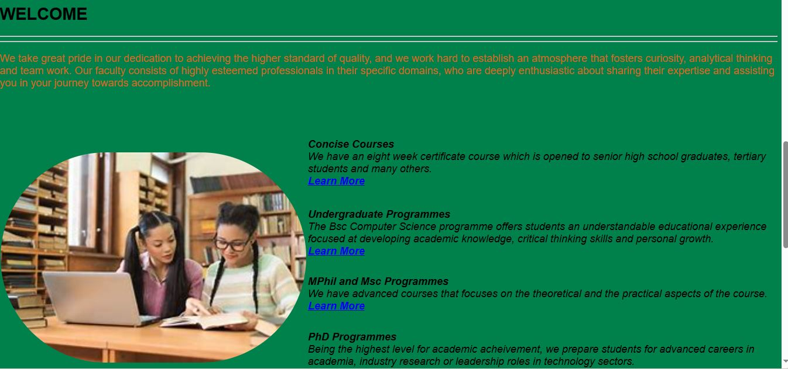
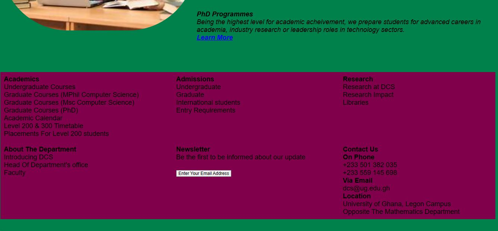

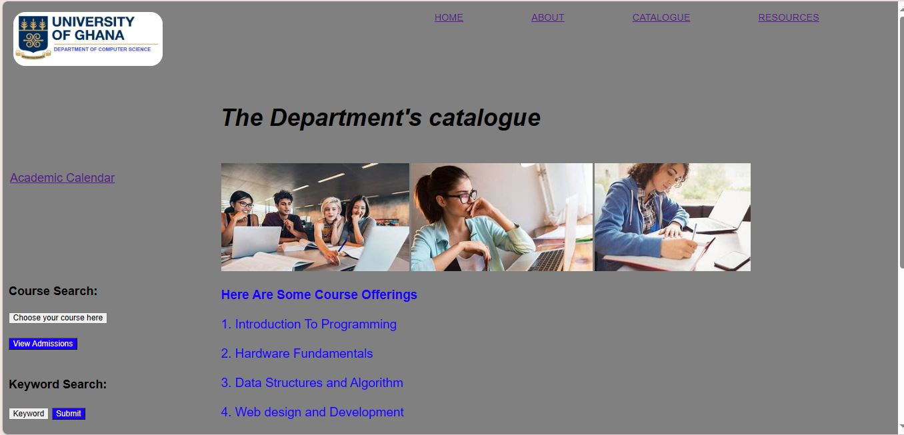
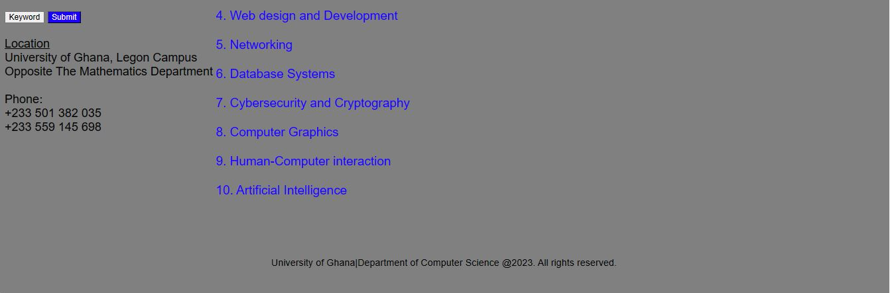

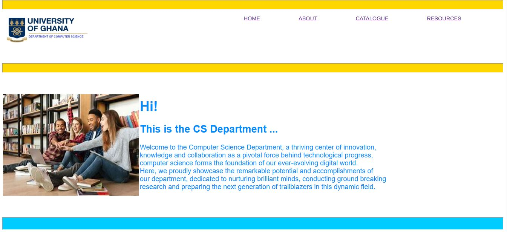
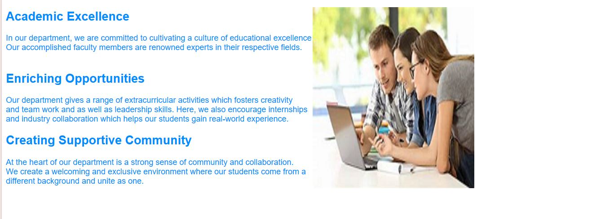
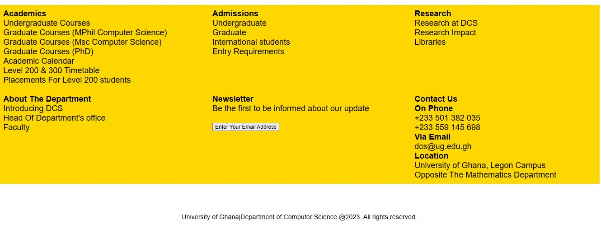

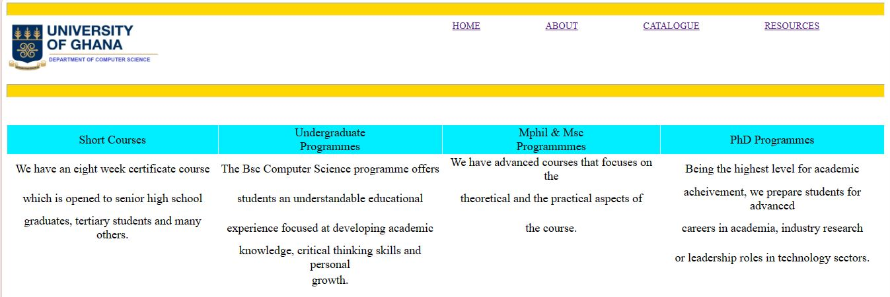
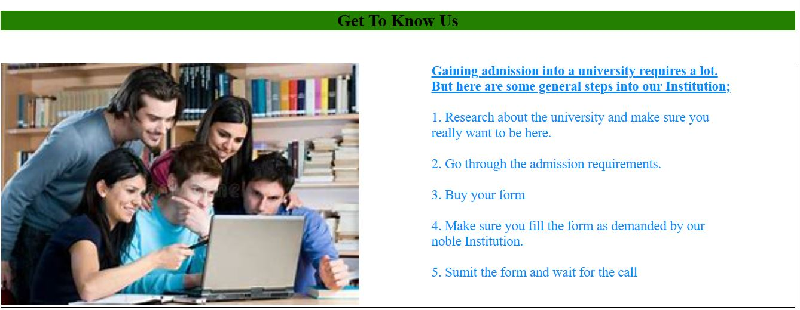

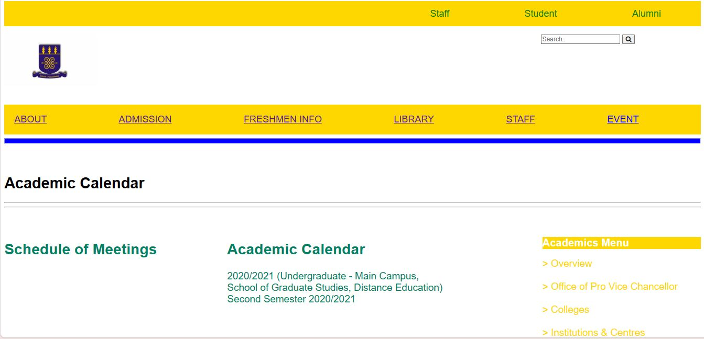
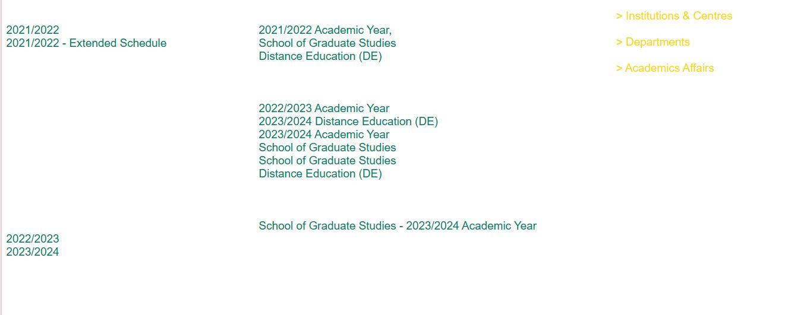
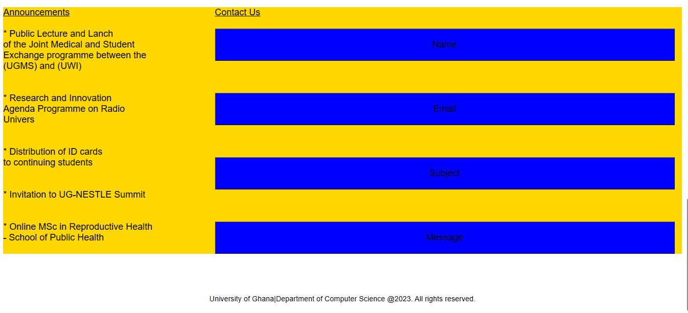

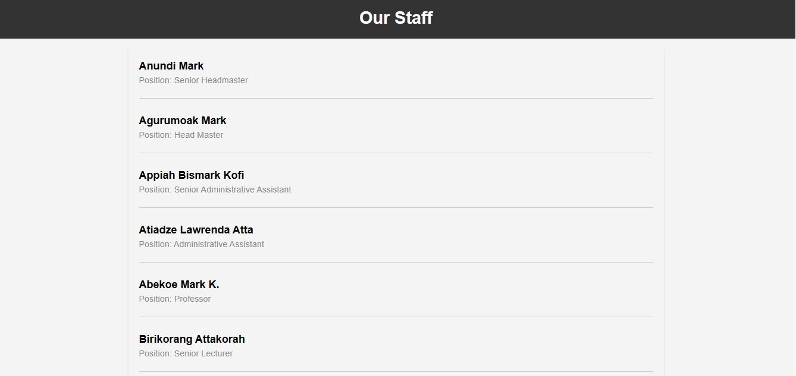
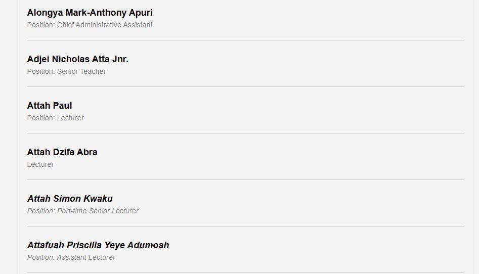
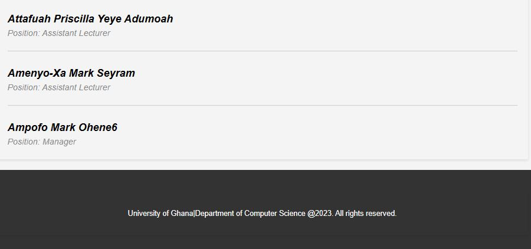

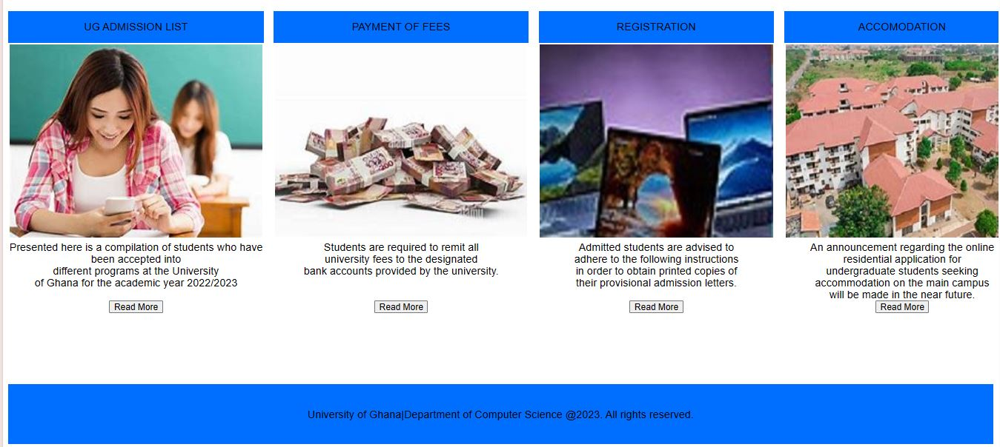

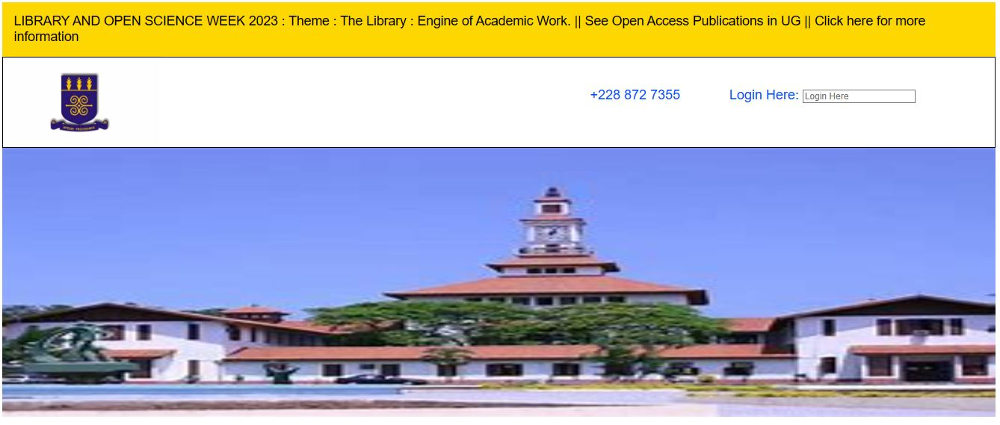
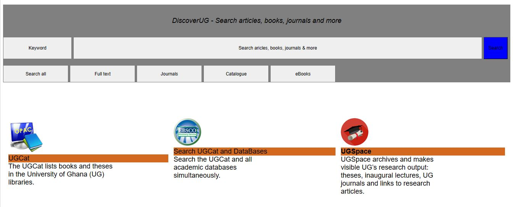
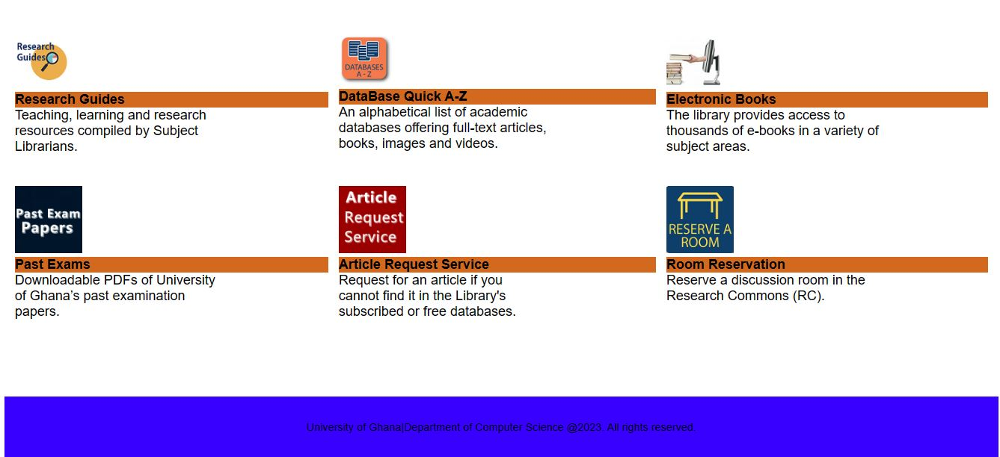

Toward the finish of the task, I got comfortable with tags and CSS styles. I figured out how to make an efficient substance. During the coding, I had the option to take care of issues I experienced effectively. I took in some git orders and how to work them with git. I likewise got to be aware of GitHub. Doing it wasn’t easy, but with commitment I learnt how to not get it wrong again.

